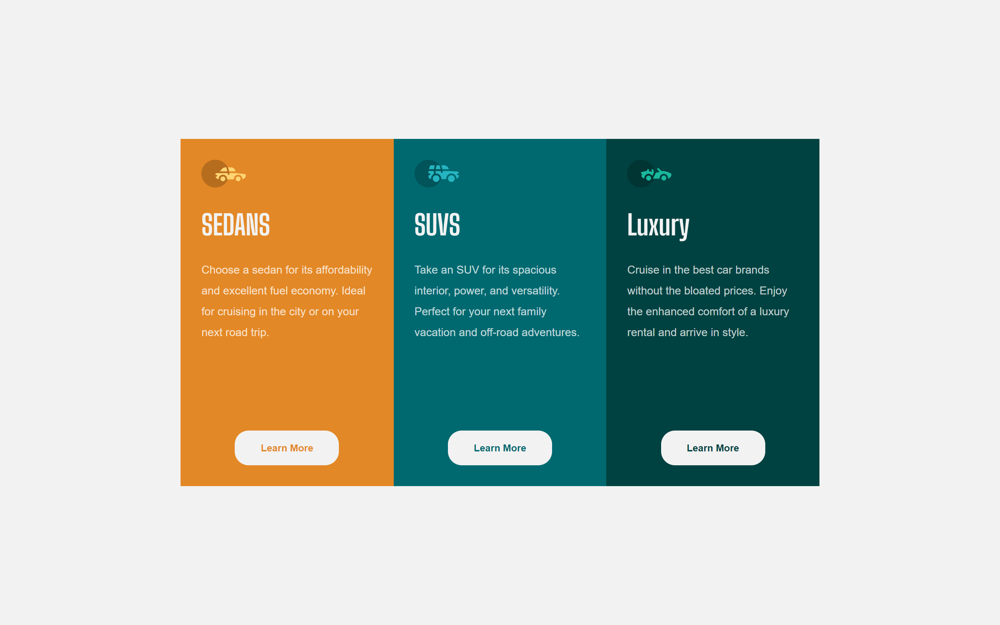
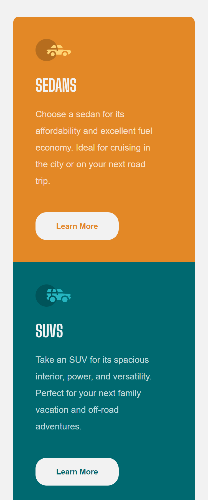
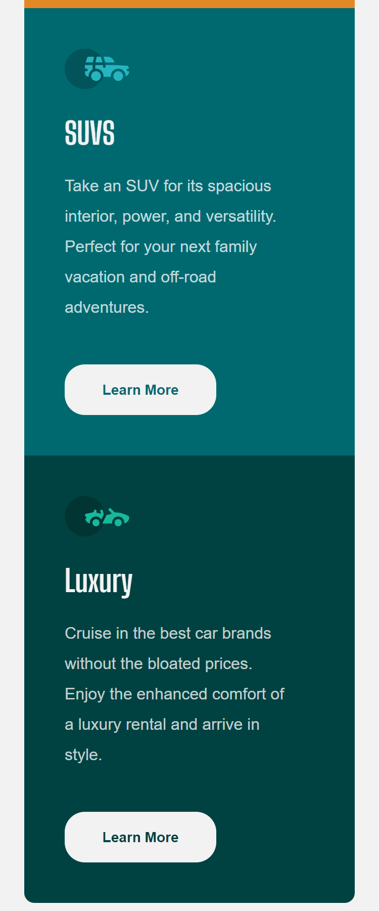

# Frontend Mentor - Challenges

This is my solution to the 3 column preview card component challenge on Frontend Mentor Website.

## Screenshot

## Links

- Solution URL: 
- Live Site URL: https://joyce-souza.github.io/3-column-preview-card-component/

## Built with

- Semantic HTML5 markup
- Flexbox
- Media query

## Author

- Github: https://github.com/joyce-souza
- Frontend Mentor: https://www.frontendmentor.io/profile/joyce-souza
